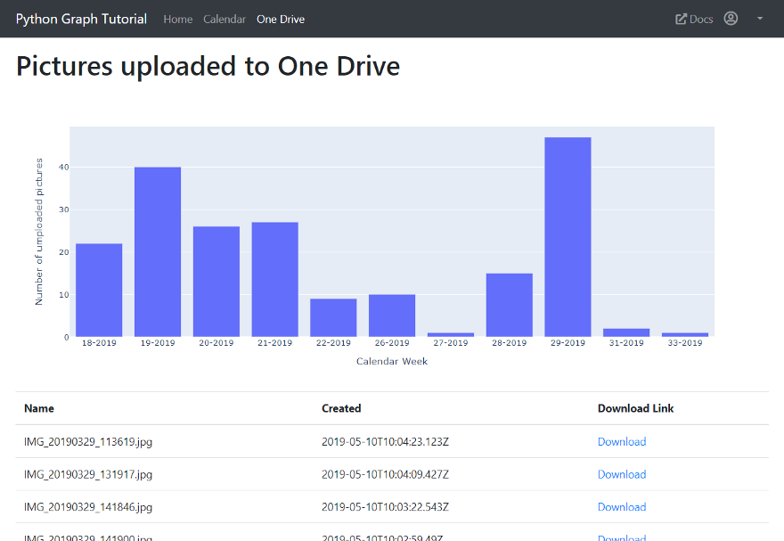

# Office365 Visualization App

Uses the Microsoft Graph API to retrieve data about the logged in user and visualizes it with Plotly. 

Source code for https://towardsdatascience.com/what-microsoft-knows-about-you-and-how-you-can-use-it-to-generate-your-own-insights-1bd0aa0881ed

## Built With

* Django
* Plotly 

## License
[MIT](https://choosealicense.com/licenses/mit/)
